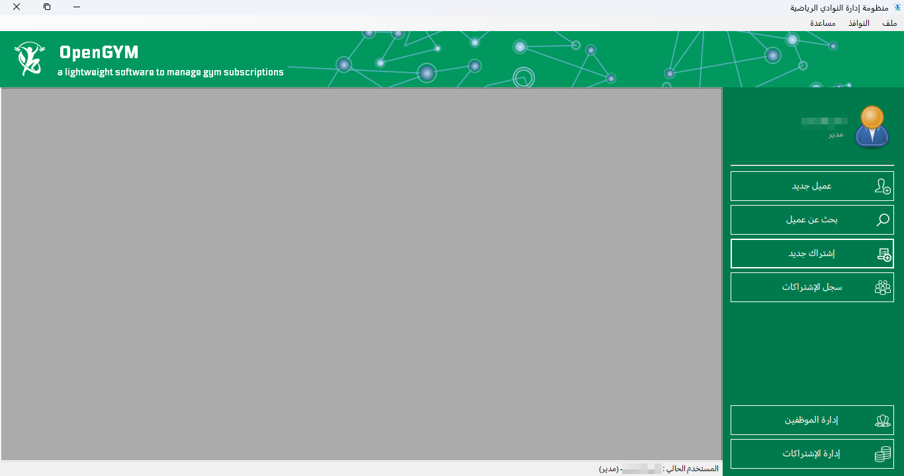
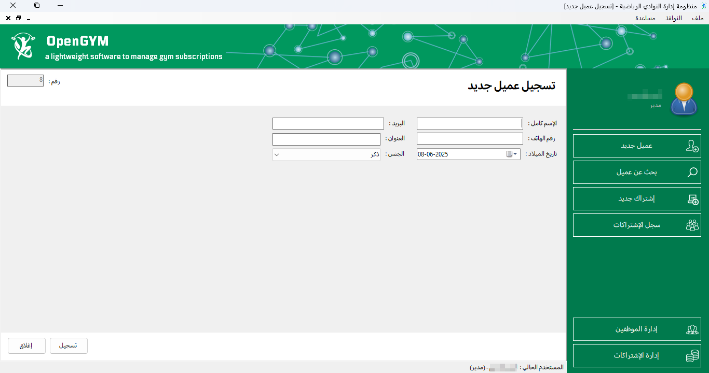
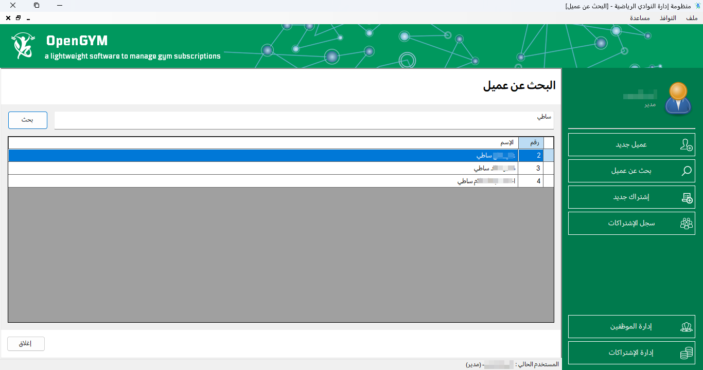
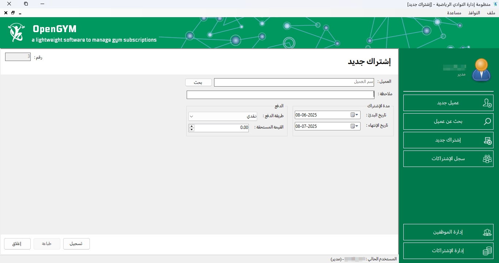
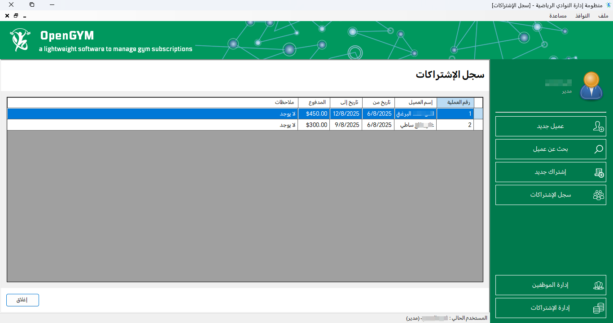

# OpenGYM | GYM Management System


## Overview
This project is targeting .NET 8 and aims to provide a robust and efficient solution for managing gym subscriptions.

## Screenshots







## License
```
Copyright (C) 2025  Anas Yusuf <me@anasov.ly>.

This software is proprietary and is not free or open-source.
It is a paid software, and any use, distribution, or modification without a valid license is strictly prohibited.
Unauthorized use will result in legal action, including but not limited to lawsuits.  

For licensing inquiries, please contact the software owner.
```